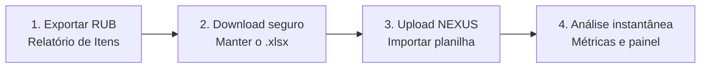

<div align="center">


<br/>

# NEXUS INSIGHT

### Auditoria & Dashboard Inteligente

Transforme a planilha do RUB em um painel visual de auditorias em segundos, direto no navegador.

<br/>


</div>

---

## Sumário

- [Sobre o projeto](#sobre-o-projeto)
- [Funcionalidades](#funcionalidades)
- [Visão geral do fluxo](#visão-geral-do-fluxo)
- [Passo a passo de uso](#passo-a-passo-de-uso)
- [Aba Setores](#aba-setores)
- [Módulo de Validade](#módulo-de-validade)
- [Como executar](#como-executar)
- [Estrutura do repositório](#estrutura-do-repositório)
- [Privacidade](#privacidade)
- [Créditos](#créditos)

---

## Sobre o projeto

O **NEXUS INSIGHT** é um dashboard de auditorias que roda em **um único arquivo `index.html`**. Ele lê as planilhas exportadas do **RUB** (`.xlsx` ou `.csv`), identifica colunas, setores, colaboradores e horários automaticamente e monta indicadores prontos para acompanhar a operação da **Loja 294**.

Não precisa de servidor, instalação ou banco de dados: abriu o arquivo, importou a planilha, analisou.

---

## Funcionalidades

| Módulo | O que entrega |
| --- | --- |
| **Auditoria de Etiqueta** | SKU total, com estoque, auditados, restantes, acertos e erros; etiquetas desatualizadas; fluxo de auditorias por hora; precisão e conclusão |
| **Auditoria de Presença** | Mesmos indicadores, com ranking de colaboradores e não lidos com vendas |
| **Ruptura** | Estrutura da Presença, com taxa de ruptura calculada sobre o SKU do dia |
| **Validade** | Radar de produtos vencidos e próximos do vencimento (janela D+10), setores e fornecedores afetados |
| **Informativo** | Escala semanal das auditorias |
| **Créditos** | Informações do projeto |

Dentro de cada auditoria, as abas organizam a análise:

`📊 Estatística` · `🏆 Colaborador Destaque` · `👥 Colaboradores` · `📦 Setores` · `📍 Corredores` · `🛒 Não Lidos com vendas`

Outros recursos:

- Leitura automática das colunas da planilha (colaborador, situação, setor, horário, corredor)
- Botão para **copiar como imagem** cada indicador, pronto para colar no WhatsApp ou em relatórios
- Interface escura com efeito de vidro, responsiva e animada

---

## Visão geral do fluxo



<div align="center">

</div>

---

## Passo a passo de uso

> Guia completo em PDF: [`docs/Passo_a_Passo_NEXUS_INSIGHT.pdf`](docs/Passo_a_Passo_NEXUS_INSIGHT.pdf)

### Passo 1 · Acessar o Relatório de Itens no RUB

1. No menu lateral do RUB, clique em **Auditorias de Etiqueta** ou **Auditorias de Presença**.
2. Na barra superior, selecione **Relatório de Itens**.

<div align="center">

</div>

### Passo 2 · Configurar e gerar a planilha

1. Em **Situação atual da auditoria**, marque as três opções: **Aberta**, **Encerrada** e **Iniciando**.
2. Clique no botão **Planilha**, no canto inferior direito.

<div align="center">

</div>

### Passo 3 · Autorizar o download

Se o navegador exibir o alerta de bloqueio de segurança, clique em **Manter** para concluir o download do arquivo `.xlsx`.

<div align="center">

</div>

### Passo 4 · Abrir a área de upload no NEXUS

1. Abra o **NEXUS INSIGHT** no navegador.
2. No menu lateral **AUDITORIA**, clique no **ícone de seta para cima** do módulo desejado (Etiqueta, Presença ou Ruptura).

<div align="center">

</div>

### Passo 5 · Enviar e confirmar os dados

1. **Arraste** a planilha para a janela ou **clique para selecionar** (formatos aceitos: `XLSX` ou `CSV`).
2. Confira o resumo (registros encontrados, colaboradores e setores identificados, colunas detectadas) e clique em **Confirmar importação**.

<div align="center">

</div>

### Pronto

O painel é atualizado na hora com as métricas da auditoria.

<div align="center">

</div>

---

## Aba Setores

A aba **Setores** de cada auditoria (Etiqueta, Presença e Ruptura) mostra os itens planilhados por setor:

| Coluna | Significado |
| --- | --- |
| **Setor** | Setor do produto (vindo de *Setor* ou *Classe de Produto Raiz*) |
| **Restantes** | Itens com estoque ainda não auditados |
| **SKU** | Itens planilhados com estoque no setor |
| **Parcial** | Auditados ÷ SKU do setor, com barra de progresso |

Ao lado da tabela ficam os cards **Parcial da auditoria**, **SKU** e **Última atualização**. A linha **TOTAL** soma restantes e SKU e mostra o parcial geral.

> As colunas SKU e Parcial por setor são calculadas a partir da planilha importada. Dados que vieram embutidos no arquivo, sem importação, mostram `—` até a planilha ser importada.

---

## Módulo de Validade

Além das auditorias, o NEXUS lê o **Relatório de Validade** do RUB e monta o **Radar de Validade**: vencidos, até 3 dias, 4 a 10 dias, total no radar, setores e fornecedores afetados.

**Como exportar (passo extra):**

1. No RUB, abra **Dashboard → Validade** e clique em **Relatório**.
2. Filtre a situação desejada e clique em **Planilha**.
3. No NEXUS, use o ícone de seta para cima do módulo **Validade** e importe o arquivo.

<div align="center">

<br/><br/>

</div>

---

## Como executar

```bash
# clonar o repositório
git clone https://github.com/<seu-usuario>/<seu-repositorio>.git
cd <seu-repositorio>

# abrir no navegador (qualquer um dos dois)
open index.html        # macOS
start index.html       # Windows
```

Também funciona publicado em **GitHub Pages**: em *Settings → Pages*, selecione a branch `main` e a pasta `/ (root)`.

**Requisitos:** um navegador moderno (Chrome, Edge ou Firefox). A fonte da interface é carregada do Google Fonts, então é preciso internet na primeira abertura.

---

## Estrutura do repositório

```text
.
├── index.html                      # aplicação completa (HTML + CSS + JS)
├── README.md
└── docs/
    ├── Passo_a_Passo_NEXUS_INSIGHT.pdf
    └── passo-a-passo/              # imagens usadas neste README
```

---

## Privacidade

As planilhas são processadas **localmente no navegador**. Nenhum arquivo é enviado a servidores. Antes de publicar o repositório, confira se o `index.html` não contém dados reais da operação (nomes e matrículas de colaboradores, por exemplo) que não devam ficar públicos.

---

## Créditos

Desenvolvido por **Jaderson TI — Loja 294**.

<div align="center">

<sub>NEXUS INSIGHT · Auditoria & Dashboard Inteligente</sub>

</div>
